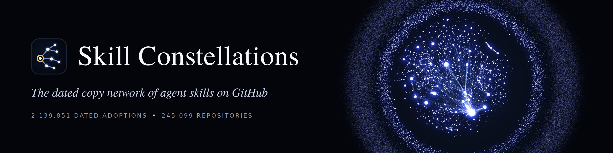
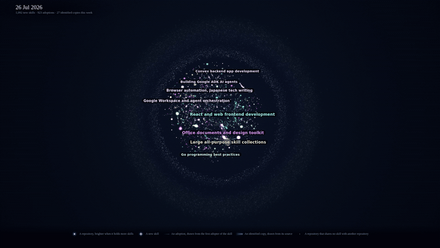

<p align="center">
  
</p>

<p align="center">
  <a href="https://arxiv.org/abs/2610.11169"><b>Paper</b></a>
  &nbsp;&middot;&nbsp;
  <a href="https://fahdseddik.github.io/Skill-Constellations/"><b>Viewer</b></a>
  &nbsp;&middot;&nbsp;
  <a href="https://github.com/FahdSeddik/Skill-Constellations/releases/tag/data-v1.0"><b>Data release</b></a>
  &nbsp;&middot;&nbsp;
  <a href="https://huggingface.co/datasets/FahdSeddik/skill-constellations"><b>Hugging Face</b></a>
  &nbsp;&middot;&nbsp;
  <a href="#running-the-viewer-locally"><b>Running the viewer locally</b></a>
</p>

Agent skills are folders of instructions and scripts (`SKILL.md`) that coding agents such as Claude Code, Codex and Cursor follow with the permissions of their user.
Developers share skills by copying them between repositories, without a registry, versions or an update channel.
This repository holds the viewer and the data of Skill Constellations, the dated copy network of agent skills on GitHub.
The network is reconstructed from the git history of every `SKILL.md` in [GitSkills](https://doi.org/10.5281/zenodo.21875637).
It dates each adoption of a skill by a repository and links each copy to the repository it came from.
The network formed by the copies of a single skill is the **constellation** of that skill.

## The repository network

<p align="center">
  <a href="https://fahdseddik.github.io/Skill-Constellations/media/network.mp4"></a>
</p>

The animation shows the repository network over ten months of copying, up to the July 2026 snapshot.
Each star is a repository, placed near the repositories with which it shares skills, and each line is an adoption of a skill.
Repositories that share no skill with another repository form the outer ring.

## A skill constellation

<p align="center">
  <a href="https://fahdseddik.github.io/Skill-Constellations/media/skill.mp4"></a>
</p>

The animation shows the constellation of `web-design-guidelines` as it grows from its first adopter through twelve generations of copies.
Each animation links to its full-resolution video.
The [viewer](https://fahdseddik.github.io/Skill-Constellations/) replays the constellations of the most adopted skills.

## Running the viewer locally

The viewer is a Python application in `ui/`.
It reads its tables from `ui/data/` and needs no other download.
It requires Python 3.12 and [uv](https://docs.astral.sh/uv/).

```
make viewer
```

`make viewer` installs the dependencies, serves the viewer and prints its address (by default `http://localhost:8501`).
The viewer has three pages.

- **Repository network** replays the dated history of every repository with a dated adoption.
- **Skill constellation** replays the constellation of one of the most adopted skills, day by day from its first adopter.
- **Spread model replay** shows the observed copies beside one simulated run of the spread model, with no audit or with one of three audits.

```
make site
make demo
```

`make site` writes the Repository network and Skill constellation pages as a static site to `dist/site/`.
`make demo` records the two animations above into `media/` and requires [ffmpeg](https://ffmpeg.org/).

## Data

Release [`data-v1.0`](https://github.com/FahdSeddik/Skill-Constellations/releases/tag/data-v1.0) holds the dated copy network under CC BY 4.0 (750 MB in all).
Every table is stored as Parquet, and every table except `history` is also stored as gzipped CSV.

| File | Rows | One row per |
|---|---:|---|
| `history` | 16,222,844 | Change to a `SKILL.md` in the git history of a repository (commit, time, status, old and new blob, path) |
| `adoptions` | 2,139,851 | Adoption of a skill lineage by a repository, dated by its first appearance in that repository, with a flag for the first adoption of the lineage |
| `lineages` | 1,434,748 | Skill lineage, the versions of one skill linked by edits, with its origin and number of adopters |
| `copy_events` | 18,282 | Commit that adds ten or more skills, where one earlier adopter, the source, already held at least half of the existing lineages |
| `transmissions` | 644,626 | Lineage in a copy event whose source held it first |

The same tables are on Hugging Face as [FahdSeddik/skill-constellations](https://huggingface.co/datasets/FahdSeddik/skill-constellations), where the `datasets` library loads each one by name.
The release README holds the data dictionary, row counts and checksums.
No author name, email address or commit message is included, and lineages holding a confirmed malicious skill are withheld.
The viewer tables in `ui/data/` hold no repository identifier.
Please cite GitSkills for the underlying snapshot when you use the data.

## Citation

If you use the data or the viewer, please cite the paper and GitSkills.

```bibtex
@misc{seddik2026skillconstellations,
  title         = {Skill Constellations: Tracing the Supply Chain of Agent Skills on {GitHub}},
  author        = {Seddik, Fahd},
  year          = {2026},
  eprint        = {2610.11169},
  archivePrefix = {arXiv},
  primaryClass  = {cs.SE},
  url           = {https://arxiv.org/abs/2610.11169}
}
```

## Licenses

The code is released under the [MIT License](LICENSE).
The derived data, including `ui/data/`, is released under [CC BY 4.0](LICENSE-DATA) and derives from GitSkills, which is also released under CC BY 4.0.
